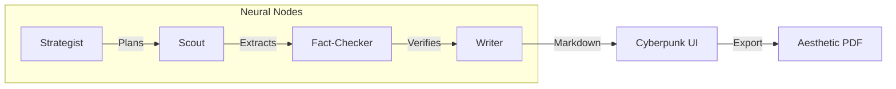

# 🌐 SOVEREIGN ARCHIVIST v1.0
### *Local-First Multi-Agent Intelligence & Research Orchestrator*


Sovereign Archivist is a professional-grade research engine that runs entirely on your local hardware. By leveraging **LangGraph** to coordinate a multi-agent "Neural Network," it automates the process of web-scouring, fact-checking, and technical writing—ensuring 100% data privacy and zero API costs.

---

## ⚡ The Agentic Workflow
Unlike standard chatbots, Sovereign Archivist breaks tasks down into a logical pipeline where specialized agents critique each other's work.



## 🚀 Key Features
**Multi-Agent Reasoning**: Uses a Strategist to expand queries, a Scout for live web access, a Fact-Checker to catch hallucinations, and a Writer for professional synthesis.

**Privacy-First**: Powered by Ollama. Your research data never leaves your machine.

**Real-Time Streaming**: Built with FastAPI Server-Sent Events (SSE), allowing you to see the AI's thought process as it happens.

**"Cyberpunk" Dashboard**: A high-fidelity Next.js interface with motion-tracked agent status and a live system telemetry log.

**Aesthetic PDF Engine**: One-click export that generates high-contrast, professional technical whitepapers.

## 🛠️ Tech Stack
- **Brain**: LangGraph & LangChain
- **Inference**: Llama 3 (Logic) & Mistral (Synthesis) via Ollama
- **Backend**: FastAPI (Python)
- **Frontend**: Next.js 14, Tailwind CSS, Framer Motion
- **PDF Logic**: jsPDF (Text-to-Buffer Engine)

## � Installation

### 1. Model Setup (Ollama)
Ensure you have Ollama installed and running:

```bash
ollama pull llama3
ollama pull mistral
```

### 2. Backend Initialization
```bash
# In the project root
python -m venv .venv
# On Windows:
.venv\Scripts\activate
# On Mac/Linux:
# source .venv/bin/activate

pip install -r requirements.txt
python main.py
```

### 3. Frontend Initialization
```bash
cd frontend/researcher
npm install
npm run dev
```

## 🧪 System Stress Test
To see the Fact-Checker node in action, try the "Hallucination Trap":

**Query**: "Research the impact of the 2025 underwater volcanic eruption in the Great Lakes."

**Outcome**: The system will identify the geological impossibility and flag the lack of verifiable evidence in the live telemetry log, rather than hallucinating a response.

## 👨� Author
**Deepanshu**
Class 11 Student & AI Engineer
Focusing on Local LLMs, Python Frameworks, and Agentic Workflows.
